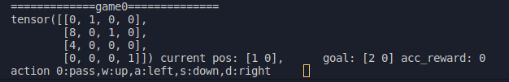

### Trajectory transformer in maze (mazeGPT)    
This repo implement [Trajectory transformer](https://github.com/jannerm/trajectory-transformer) in maze environment.   
This project is self-contained, so you don't need to install openAI gym or d4rl.    
The maze environment is in the maze folder, modified from [mctx_learning_demo](https://github.com/kenjyoung/mctx_learning_demo)         

https://github.com/jaco267/Trajectory_Transformer_in_maze/assets/87292294/c3440c56-afa1-4e37-ab19-c071b56a1b21
   

```sh
python --version
# Python 3.10.12
```
  
#### 1. play with maze environment
Run the following command to get familiar with the maze environment 

```sh
python gen_data.py --mode play
```

number 8 is player      
number 4 is goal       
number 1 is wall    
press w,a,s,d to move the player, if you press other keys the player will stay in the same place     
In this example the timeout step is 10 (game over after 10 steps)  
  



#### 2. generate maze dataset
run the following command to generate random agent maze dataset
(randomly choose action in uniform distribution).    
This will generate a data file in `datasets/maze/train/buf0.pt`      
        
In this example we'll generate a maze dataset with 1000_000 steps.   
It will take about 10 minutes  
  
```sh
python gen_data.py --mode gen --n_steps 1000_000 --time_out 50
```   
   
#### 3. train the agent 
The agent (gpt) will learn the state transition of the maze environment 
from the maze dataset we've already generated.      
In this example we'll only train 1 epoch.  
This will takes about 15 min on a RTX3060 gpu.   
   
```sh
#  It will generate /logs/maze/gpt/pretrained/state_1.pt
python train.py --max_path_length 61  --n_epochs_ref 1  --n_saves 1   
                               #50+10+1 ini_state #maze step max_len +subseq_len+1
```
### 4. test the agent (planning) 
run the following command to watch the agent play with the maze   
   
```sh
python plan.py --horizon 5 --beam_width 32  --seed 43 --enable_breakpoint False

python plan.py --horizon 5 --beam_width 32  --seed 42
#press c to continue 
```

```
[ Progress ] 5 / 5 | discount: 0.9900 | vmax: -4.9025 | vmin: -21.3585 | vtmax: -0.0016 | vtmin: -17.7038 | x: [32, 95] | 6.6 Hz
[4.] should be 0~4                                                                                  
[[0. 0. 1. 0.]                                                                                      
 [0. 4. 0. 1.]
 [1. 0. 0. 0.]
 [2. 0. 0. 1.]] right
(Pdb) c        #press c in here to continue 2 is player 4 is goal
[ Progress ] 5 / 5 | discount: 0.9900 | vmax: -4.9025 | vmin: -4.9031 | vtmax: -0.0016 | vtmin: -16.6616 | x: [32, 114] | 18.5 Hz
[1.] should be 0~4                                                                                  
[[0. 0. 1. 0.]                                                                                      
 [0. 4. 0. 1.]
 [1. 0. 0. 0.]
 [0. 2. 0. 1.]] up
(Pdb) c       #press c in here to continue 2 is player 4 is goal 
[ Progress ] 5 / 5 | discount: 0.9900 | vmax: -4.9025 | vmin: -4.9025 | vtmax: -0.0016 | vtmin: -0.0016 | x: [32, 133] | 17.0 Hz
[1.] should be 0~4                                                                                  
[[0. 0. 1. 0.]                                                                                      
 [0. 4. 0. 1.]
 [1. 2. 0. 0.]
 [0. 0. 0. 1.]] up
(Pdb) c       #press c in here to continue 2 is player 4 is goal 
```
   
```sh
#  sometimes it will stuck at the corner
python plan.py --horizon 5 --beam_width 64  --seed 35
python plan.py --horizon 5 --beam_width 64  
#run 30 games and get avg return 
python plan.py --horizon 5 --beam_width 64  --seed 36 --enable_breakpoint False --simulation_game_num 30 --timeout 50
=====avg_score=-18.8=====
# [-2, -1, -50, -50, -1, -2, -4, -2, -5, -50, -2, -50, -1, -3, -50, -3, -3, -50, -1, -50, -5, -50, -50, -1, -12, -50, -1, -3, -1, -11]
```
### 5x5 maze
```
python gen_data.py --mode gen --n_steps 1000_000  --time_out 50 --w_h 5
python train.py --max_path_length 61  --n_epochs_ref 1  --n_saves 1  --n_epochs_ref 1
python plan.py --horizon 5 --beam_width 64  --seed 36 --enable_breakpoint False --simulation_game_num 30 --timeout 64
=====avg_score=-14.1=====
[-22, -3, -12, -10, -64, -5, -22, -3, -3, -7, -3, -9, -3, -64, -5, -8, -3, -4, -4, -5, -3, -9, -64, -2, -5, -3, -2, -64, -7, -5]
```
### 7x7 maze
